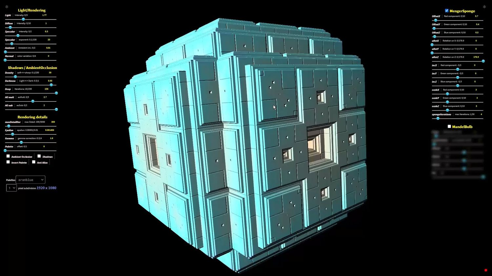
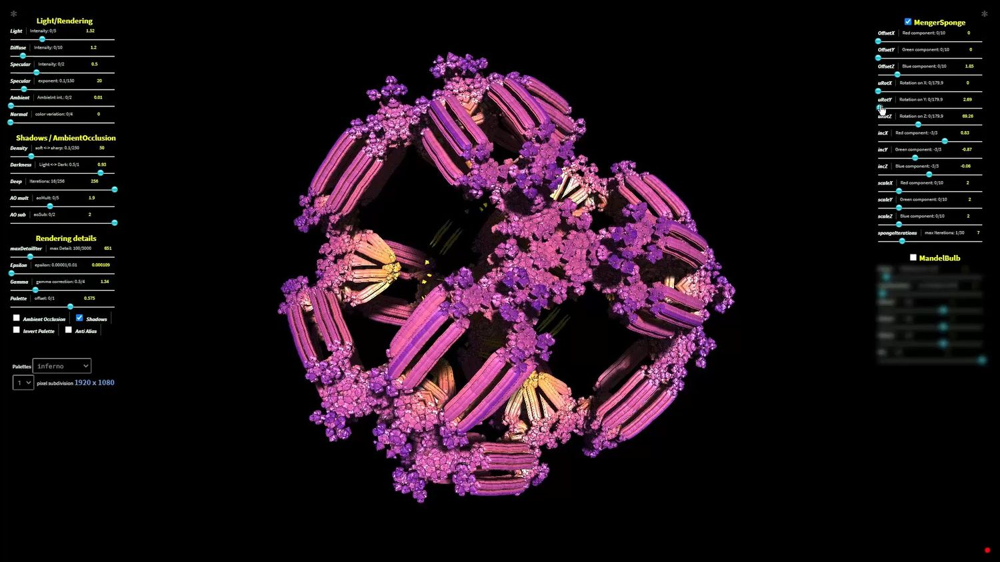

# Fractal Mandelbulb Menger sponge

https://youtu.be/bDo-jJ8bGRw\n
https://planner317.github.io/Mandelbulb/WebGL/MengerBulb/\n
Рендеринг Ray marching.\n
Фракталы Mandelbulb (3D реализация множества Мандельброта) и Губка Менгера\n
\n
Работает на WebGL 2.0 — Построена на основе OpenGL ES 3.0, для шейдеров поддерживается язык GLSL ES
